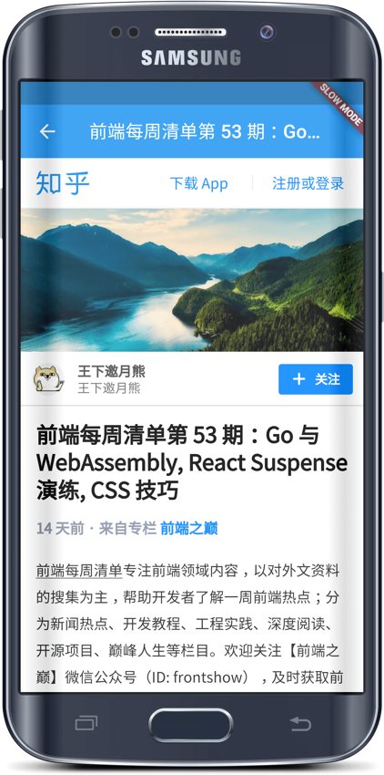

# Gank客户端

使用Flutter开发的跨平台Gank客户端。

主要是学习入门Flutter，所以没使用流行的架构开发，实现了基本的功能。

## 截图

 

 


## 感谢

* [Flutter 官网教程](https://flutter.io/tutorials/)

* [Gank接口](http://gank.io/api)

* [Flutter wanandroid客户端](https://github.com/Yonkers/flutter_wan_android)

* [Flutter WebView插件](https://github.com/dart-flitter/flutter_webview_plugin)

* [Flutter 带缓存的图片插件](https://github.com/renefloor/flutter_cached_network_image)

* [Flutter 可拉伸拖拽图片插件](https://github.com/perlatus/flutter_zoomable_image)

* [Flutter Gank客户端](https://github.com/saymagic/gank_flutter)

## License

```
Copyright 2018 oubowu

Licensed under the Apache License, Version 2.0 (the "License");
you may not use this file except in compliance with the License.
You may obtain a copy of the License at

   http://www.apache.org/licenses/LICENSE-2.0

Unless required by applicable law or agreed to in writing, software
distributed under the License is distributed on an "AS IS" BASIS,
WITHOUT WARRANTIES OR CONDITIONS OF ANY KIND, either express or implied.
See the License for the specific language governing permissions and
limitations under the License.
```